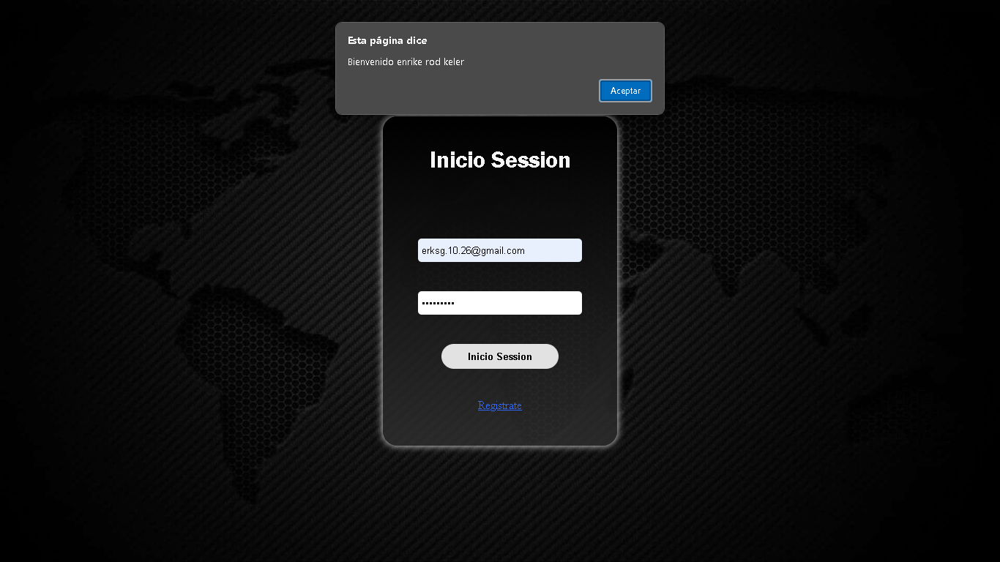
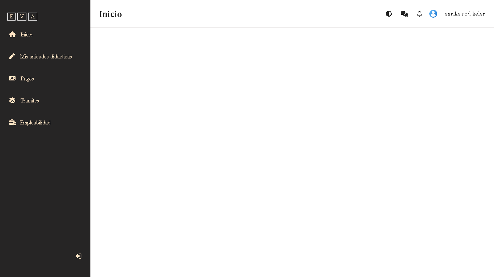

# apiAuthenticationJWT

API de autenticación que utiliza JWT (JSON Web Token) para gestionar la seguridad y el control de acceso de tu sistema, integrando herramientas como MapStruct y ExceptionHandler para mejorar la funcionalidad y la gestión de errores

